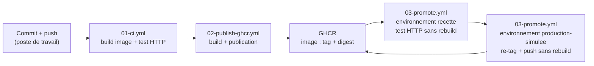

# 02 · Schéma de la chaîne CI/CD

**Projet CI/CD — Catal-Log · Vue d'ensemble et rôle de chaque étape**

| Référence | Valeur |
|---|---|
| Auteur | Candidat n° 04 |
| Dépôt GitHub | https://github.com/Lemigrant09/catal-log-ec06 |
| Bloc / Évaluation | RNCP39611BC02 — EC06 |

---

## 1. Schéma logique

## 2. Rôle de chaque étape

| Étape | Déclencheur | Rôle | Preuve produite |
|---|---|---|---|
| **01-ci.yml** | Chaque `push` / `pull_request` | Vérifie la présence des fichiers, construit l'image Docker, lance le conteneur et teste la réponse HTTP du site et de `version.json`. | Run vert + résumé « Test HTTP : OK ». |
| **02-publish-ghcr.yml** | `push` sur `main` | Construit l'image et la publie dans GHCR avec un tag `sha-<commit>`, un tag `latest` et son digest. | Image visible dans GHCR + digest dans le résumé. |
| **GHCR** | — | Conserve l'image comme artefact identifié et immuable (digest `sha256`). | Page du package avec tags et digest. |
| **03-promote.yml (recette)** | Déclenchement manuel (`workflow_dispatch`) | Télécharge l'image **déjà publiée** (sans rebuild) et la valide par un test HTTP dans l'environnement `recette`. | Résumé « Validation recette simulée » + digest observé. |
| **03-promote.yml (production-simulee)** | Suite du même run | Applique le tag `production-simulee` sur le **même artefact** et le republie, sans reconstruction. | Résumé « Mode : promotion sans rebuild » + 3ᵉ tag dans GHCR. |

Le point central de la chaîne est la **séparation entre build et promotion** : l'image n'est construite qu'une seule fois (étapes 01 et 02). La promotion (étape 03) ne fait que déplacer une étiquette sur un artefact existant. Ce qui est validé en recette est donc, octet pour octet, ce qui est promu en production simulée.

## 3. Orchestration légère (compétence C13)

Le fichier `compose.yml` décrit deux services coordonnés :

- **`web`** : le conteneur Nginx qui sert le site statique ;
- **`tester`** : un conteneur `curl` qui attend le démarrage de `web`, puis vérifie que la page d'accueil et `version.json` répondent correctement.

Docker Compose joue ici le rôle d'**orchestration légère** : il déclare les services, leurs dépendances (`depends_on`) et un réseau commun (`cicd_net`), et permet de démarrer un ensemble cohérent de conteneurs d'une seule commande. La coordination `web` + `tester` illustre la mise en relation de plusieurs conteneurs au sein d'un même environnement.

## 4. Limites de cette approche

Docker Compose convient pour une mise en situation, un test local ou une démonstration de coordination, mais ne constitue pas une orchestration de production. Dans un contexte réel, il faudrait traiter des sujets que Compose ne couvre pas nativement : haute disponibilité, répartition de charge, supervision, politique de déploiement progressif, rollback automatisé, gestion fine des accès, sauvegarde et restauration. Ces points relèveraient d'un orchestrateur comme Kubernetes, et sont analysés dans le document `07-securite-minimale.md` et le compte rendu final.
